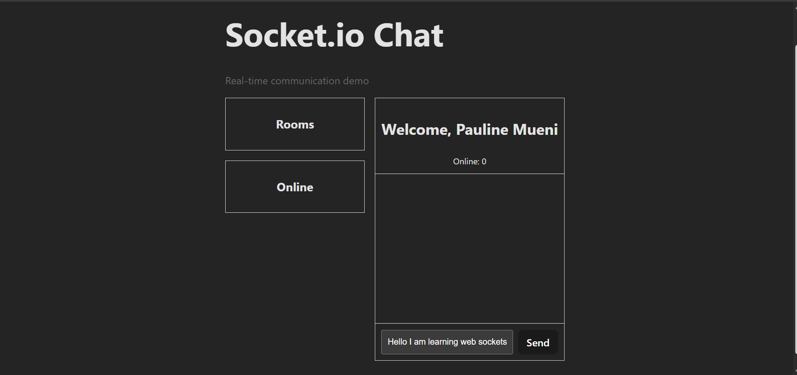

# real-time-communication-with-socket-io-pauline421

Simple example project demonstrating real-time communication using Socket.IO (Node.js).

## Features
- Basic Socket.IO server and client setup
- Real-time message broadcasting
- Minimal and easy-to-follow structure for learning

## Prerequisites
- Node.js (>= 14)
- npm or yarn

## Installation
1. Clone the repository:
  git clone <repo-url>
2. Install dependencies:
  npm install
  # or
  yarn

## Running
Start the server:
npm start
# or
yarn start

Open the client (e.g., index.html) in a browser or visit the address printed by the server (usually http://localhost:3000).

## Usage
- Connect multiple clients to the server.
- Emit messages from a client; server will broadcast to other connected clients.

Example (client-side):
socket.emit('chat message', 'Hello world');

Example (server-side):
io.on('connection', socket => {
  socket.on('chat message', msg => {
   socket.broadcast.emit('chat message', msg);
  });
});

## Project Structure (suggested)
- /server - Node.js + Socket.IO server
- /client - Client files (React/Tailwind/JS)
- README.md

## Author
Pauline421
